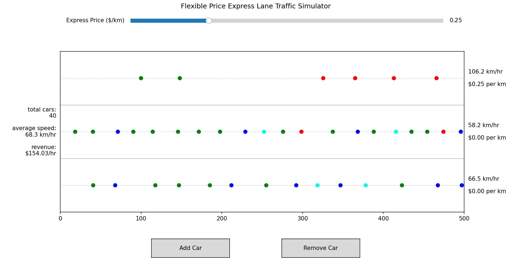
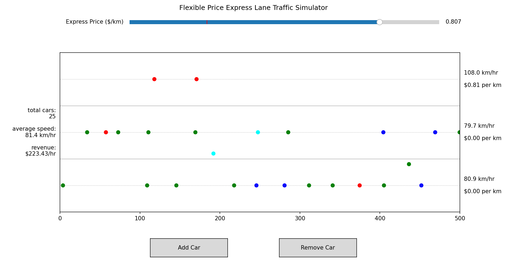

# Traffic Simulator

This application simulates a collection of cars on a road with a flexibly-priced express lane, following deterministic decision trees to decide speeds and when and whether to switch lanes.

## Getting Started

### Requirements

- Python 3.7+

### Installation

```bash
git clone https://github.com/coleb99/Traffic-Simulator
cd Traffic-Simulator
pip install -r requirements.txt
```

### Run 

```bash
python main.py
```

## Features

-Observe traffic patterns over a model multi-lane road with one variably-priced express lane

-Track traffic flow and revenue generated by the express lane during the simulation

-Cars follow realistic decision patterns to optimize their own speed while balancing cost and safety

-Adjust the price of the express lane or the number of cars on the road and observe changes to flow state.

## Examples


Screenshot of program after reaching near equilibrium with default setting


Screenshot of program after adjusting the express lane price and removing several cars


## Usage

- Adjust the price of the express lane via the slider at the top of the interface, from $0 (free) to $1/km.

- Add a car to the simulation with the Add Car button at the bottom of the interface. A new car will spawn at the left end of the first (lowest) lane at the earliest safe time and which will automatically match traffic flow.

- Remove a car from the simulation with the Remove Car button at the bottom of the interface. A random car will be zapped from existence.

- Track individual lane average speeds using the gauges on the right side of the interface. Each lane is accompanied by text indicating the price of the lane (in $/km) and the average speed of traffic in that lane.

- Track total average speed of all lanes combined using the gauge on the left side of the interface.

-Track the average revenue generated by the express lane using the gauge on the left side of the interface. This value is constantly updated to average up to the last 30 seconds of simulation run time.

## Notes:

### Environment Notes

- This project uses matplotlib animations. Some IDEs may not render animations correctly.

- For best results, run from a terminal: python main.py

### Application Notes

- Cars are color-coded by their price sensitivity. Cyan cars will never pick the express lane if it costs money, blue are somewhat price sensitive, green are less price sensitive, and red cars will always pick the express lane if it saves time.

- Car price sensitivity is randomly assigned at the start of a run or when a new car is added.

- The left and right ends of the road are connected Pac-man style.

- To get a reliable revenue reading for a given express lane price or number of cars, please allow ~30s for the system to reach equilibrium after any change.

## Project Structure

- main.py
- config.py #handles configuration file
- simulcirlce.py #handles simulation machinery
- animation.py #retrieves graphing data and updates frames
- widgets.py #handles widget operations

## Configuration

The included file config.json contains all of the parameter presets that go into the initial simulation state. Each parameter value is an array of length 3 where the first index represents the value that is read by the program. Only values in this first index will be read.
